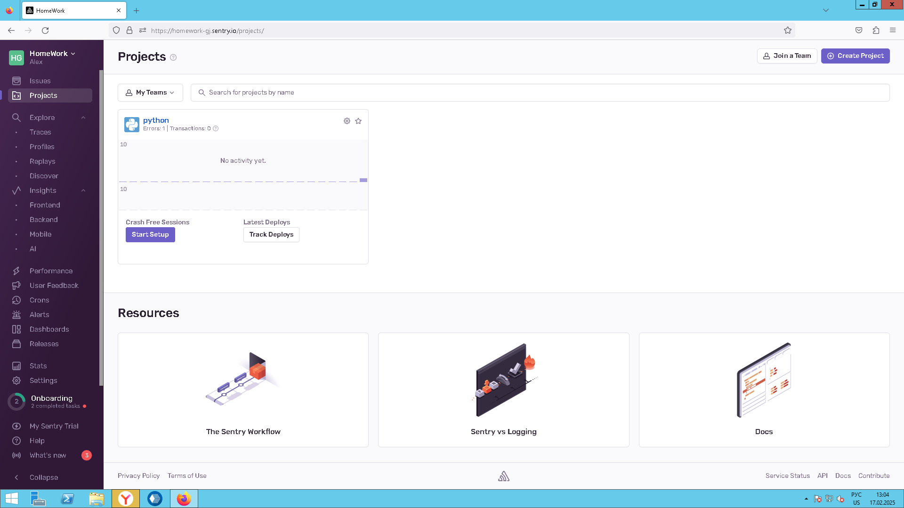
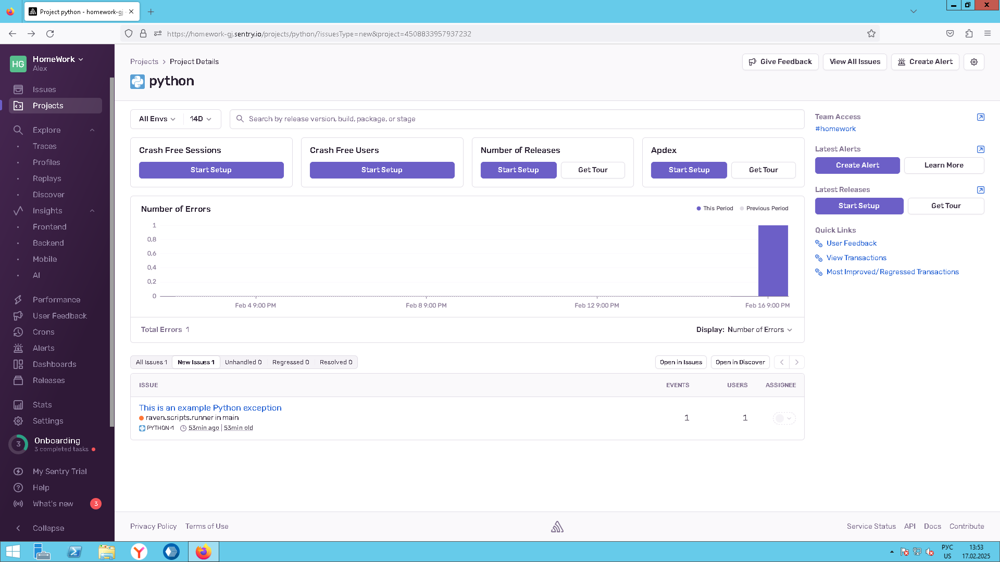
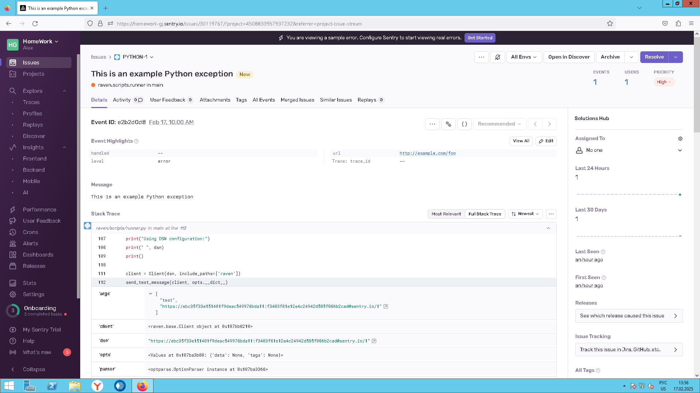
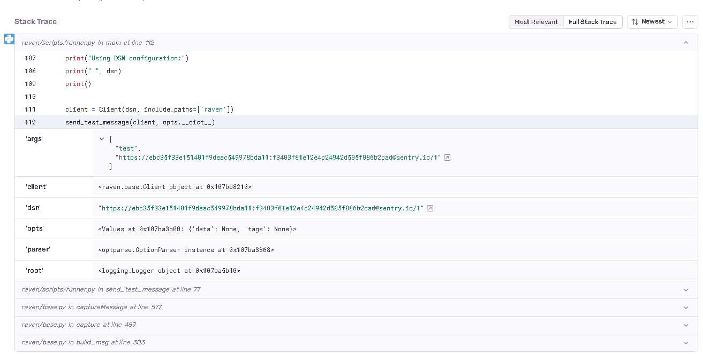
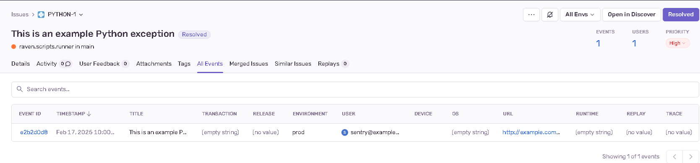
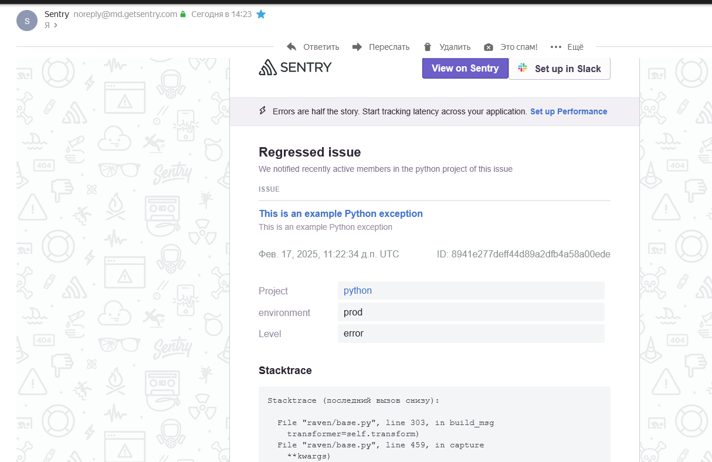
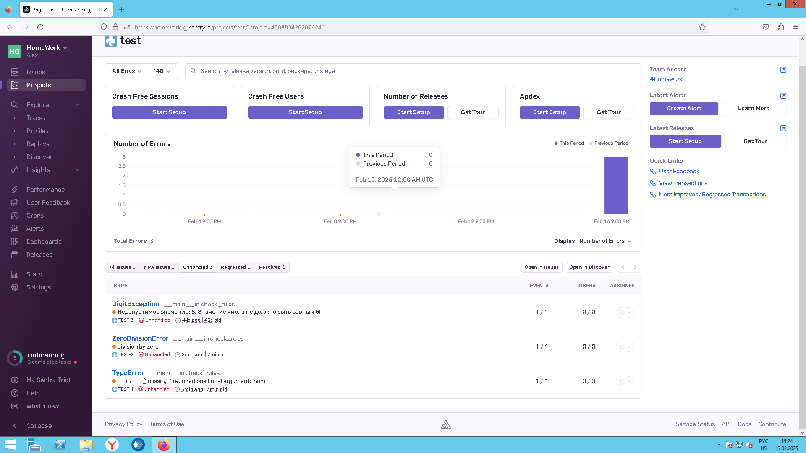
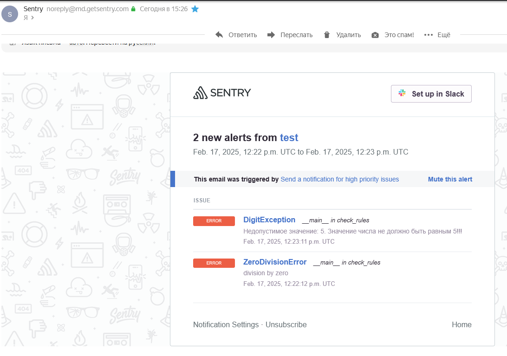

## Задание 1

Для подключения Free Cloud account:

    зайдите на sentry.io;
    нажмите «Try for free»;
    используйте авторизацию через ваш GitHub-аккаунт;
    далее следуйте инструкциям.

В качестве решения задания пришлите скриншот меню Projects.



## Задание 2

1. Создайте python-проект и нажмите Generate sample event для генерации тестового события.



2. Изучите информацию, представленную в событии.



3. Перейдите в список событий проекта, выберите созданное вами и нажмите Resolved.
4. В качестве решения задания предоставьте скриншот Stack trace из этого события и список событий проекта после нажатия Resolved.




## Задание 3

1. Перейдите в создание правил алёртинга.
2. Выберите проект и создайте дефолтное правило алёртинга без настройки полей.
3. Снова сгенерируйте событие Generate sample event. Если всё было выполнено правильно — через некоторое время вам на почту, привязанную к GitHub-аккаунту, придёт оповещение о произошедшем событии.
4. Если сообщение не пришло — проверьте настройки аккаунта Sentry (например, привязанную почту), что у вас не было sample issue до того, как вы его сгенерировали, и то, что правило алёртинга выставлено по дефолту (во всех полях all). Также проверьте проект, в котором вы создаёте событие — возможно алёрт привязан к другому.
5. В качестве решения задания пришлите скриншот тела сообщения из оповещения на почте.



6. Дополнительно поэкспериментируйте с правилами алёртинга. Выбирайте разные условия отправки и создавайте sample events.

## Задание повышенной сложности

1. Создайте проект на ЯП Python или GO (около 10–20 строк), подключите к нему sentry SDK и отправьте несколько тестовых событий.

>Ответ: [main.py](./src/main.py)

2. Поэкспериментируйте с различными передаваемыми параметрами, но помните об ограничениях Free учётной записи Cloud Sentry.
3. В качестве решения задания пришлите скриншот меню issues вашего проекта и пример кода подключения sentry sdk/отсылки событий.

```
import logging
import sentry_sdk
from sentry_sdk.integrations.logging import LoggingIntegration
import random

sentry_sdk.init(
    dsn="https://9b515d72451b90ec34510027628b1828@o4508833955184640.ingest.de.sentry.io/4508834262876240",
    # Add data like request headers and IP for users,
    # see https://docs.sentry.io/platforms/python/data-management/data-collected/ for more info
    send_default_pii=True,
)
sentry_logging = LoggingIntegration(level=logging.INFO, event_level=logging.ERROR)
```




